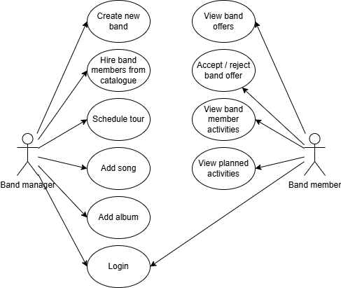
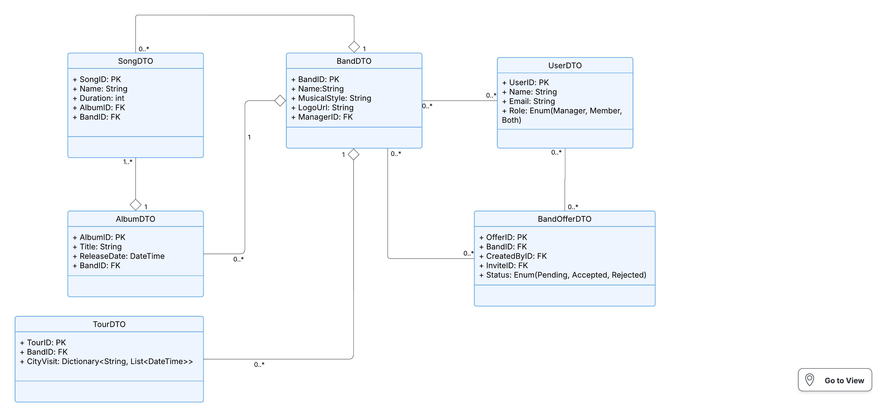

# music-band-manager

## Description
The web application allows one music band to manage their activities.

## Microservices description
### User Management Service
- Handles authentication and authorization
- Stores user profiles and their role in the system
- Allows team members to accept / reject offers, view planned activities and their bandmates

### Music Catalog Service
- Stores song details
- Manages albums and songs
- Allows adding, editing, deleting albums and songs

### Band Management Service
- Stores band details
- Handles band creatin and management
- Manages the hiring process (sending invitations to team members)

### Tour Management Service
- Manages tour schedules
- Allows band managers to create, update, and cancel tours
- Stores information about tour dates, locations, and participating bands

## Use case diagram

### Diagram Overview
This diagram shows the interactions between two primary actors:
- **Band Manager**: Responsible for creating bands, managing content, and scheduling activities
- **Team Member**: Musicians who respond to offers and participate in band activities

Key functionality includes:
- Band creation and configuration
- Team member recruitment
- Music content management (albums/songs)
- Tour scheduling
- Collaboration features for band members

Both actors share a common **Login** system, while other use cases are specific to their roles.

## Class diagram
This diagram illustrates the core data structures and relationships between key entities in the system. The classes map to the microservices described and support functionalities like band management, music cataloging, user roles, and tour scheduling.

## AI disclosure
During the development of this project, AI tools were utilized.