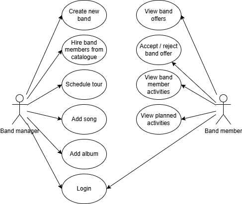
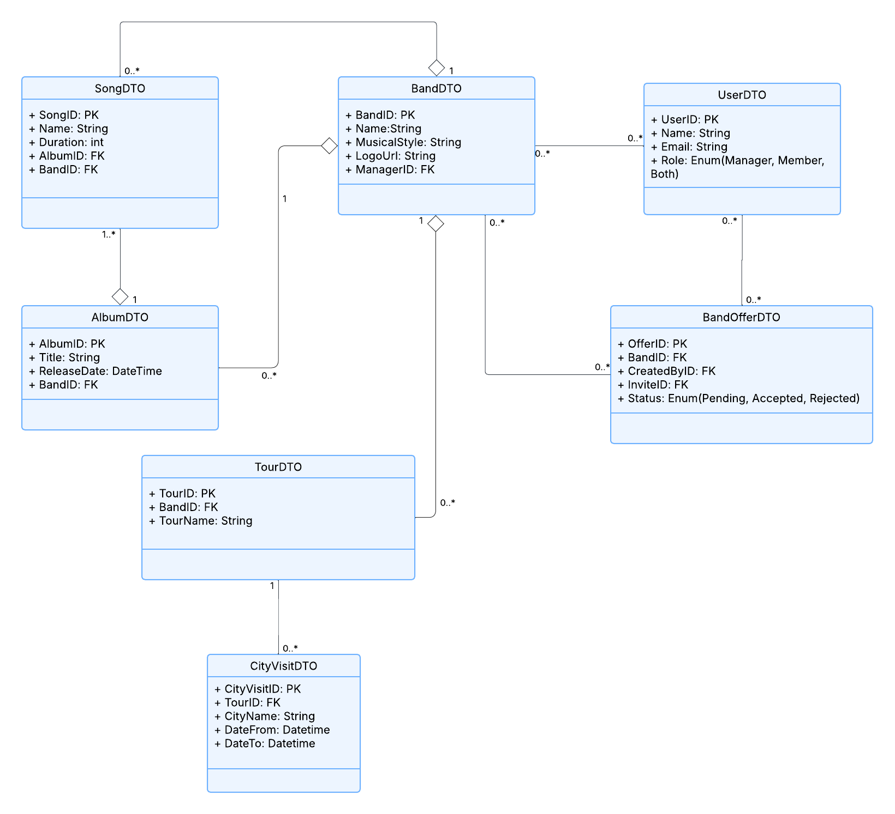

# 🎸 Music‑Band‑Manager
A microservices‑based web application that helps a music band manage everything from songs to tours.

---

## 📖 Overview
This project is composed of four core Spring Boot microservices that communicate over **Apache ActiveMQ Artemis**:

| Service                     | Purpose                                                             |
|-----------------------------|---------------------------------------------------------------------|
| **Authentication Service**  | Obtaining access tokens                                             |
| **User Management Service** | User profiles, role management                                      |
| **Music Catalog Service**   | Album and song CRUD                                                 |
| **Band Management Service** | Band creation, member invitations, configuration and offer handling |
| **Tour Management Service** | Tour scheduling and updates                                         |

All APIs are self‑documenting thanks to **Springdoc OpenAPI** (Swagger UI).
---

## 🛠 Requirements
| Needed for…            | Requirement                                                                                                   |
| ---------------------- |---------------------------------------------------------------------------------------------------------------|
| Running with Docker    | Docker Engine & Docker Compose                                                                                |
| Building from source   | Java 21+, Maven 3.4+                                                                                          |
| Running without Docker | Java 21+, Maven 3.4+ **Apache ActiveMQ Artemis ≥ 2.32** (install locally *or* run in a stand‑alone container) |
---

## 🚀 Build & Run

### Option 1 — **Full Docker Compose** (💡 *easiest*)

```bash
# from the project root
docker compose up --build
```

This spins up **all** microservices, their H2 databases, Prometheus, Grafana and an **Artemis broker** in one shot. The very first cold build may take **≈ 50s** on a typical laptop.

### Option 2 — **Run Artemis externally, services locally**

If you prefer to debug the Spring Boot services directly from your IDE, keep Artemis running on its own and start each microservice with Maven.

```bash
docker run -d --name artemis \
  -e ARTEMIS_USERNAME=admin \
  -e ARTEMIS_PASSWORD=admin \
  -p 61616:61616 \  # JMS
  -p 8161:8161   \  # Web console
  quay.io/artemiscloud/activemq-artemis:latest
```

The broker Web console will be available at [http://localhost:8161](http://localhost:8161) (user/pass: `admin`/`admin`).


Artemis listens on port `61616` by default.

> **Connection settings** — All services assume `tcp://localhost:61616` for JMS and use the default `admin` / `admin` credentials. Adjust `application.yml` if you changed these.

Next, in **each** microservice directory (`user-service`, `band-service`, `music-catalog-service`, `tour-service`) run:

```bash
mvn clean install
mvn spring-boot:run
```

---

## 🔍 API Endpoints (Swagger UI)
| Service                 | URL                                                                            |
|-------------------------|--------------------------------------------------------------------------------|
| Authentication Service  | [http://localhost:8084/token](http://localhost:8084/token)                     |
| User Service            | [http://localhost:8091/swagger-ui.html](http://localhost:8091/swagger-ui.html) |
| Band Service            | [http://localhost:8092/swagger-ui.html](http://localhost:8092/swagger-ui.html) |
| Music Catalog Service   | [http://localhost:8093/swagger-ui.html](http://localhost:8093/swagger-ui.html) |
| Tour Service            | [http://localhost:8094/swagger-ui.html](http://localhost:8094/swagger-ui.html) |
| Artemis Broker          | [http://localhost:8161](http://localhost:8161)                                 |
| Prometheus              | [http://localhost:9090](http://localhost:9090)                                 |
| Grafana                 | [http://localhost:3000](http://localhost:3000)                                 |
---

## 🔒 Authentication and Authorization
- **1)** Go to [Authentication Service](http://localhost:8084/token) to log in and redeem your Bearer access token
- **2)** Use your Bearer access token in swagger of your chosen service to log in
- There are three scopes used in the application:
    - **test_1** - Used for general operations, where no special authorization is required
    - **test_2** - Used for band manager's operations
    - **test_3** - Used for musician's operations
---

## 🎬 Showcase
- Read detailed instructions on how to run the showcase test in the [showcase](readme_showcase.md) section.
---

## 🌱 Seed/Clear Data

- The application may be seeded with initial data or completely cleared. simply set the `seed` or `clear` property to `true` in the `application.yml` file of each service. This will create a few users, bands, albums, and songs.
- if both properties are set to `true`, the application will be cleared first and then seeded with new data.
```
app:
  db:
  clear: false
  seed:  false  
  ```
---

## 💡 Tips
- **Database persistence** — when using Docker Compose, H2 volumes are persisted under `./data/` so you won’t lose data between restarts.
---

## 📌 Use Case Diagram


### Diagram Overview
This diagram shows the interactions between two primary actors:
- **Band Manager**: Responsible for creating bands, managing content, and scheduling activities
- **Team Member**: Musicians who respond to offers and participate in band activities

Key functionality includes:
- Band creation and configuration
- Team member recruitment
- Music content management (albums/songs)
- Tour scheduling
- Collaboration features for band members

Both actors share a common **Login** system, while other use cases are specific to their roles.


## 🧬 Class Diagram
This diagram illustrates the core data structures and relationships between key entities in the system. The classes map to the microservices described and support functionalities like band management, music cataloging, user roles, and tour scheduling.

---

## 📝 AI Disclosure
During the development of this project, AI tools were utilized.
